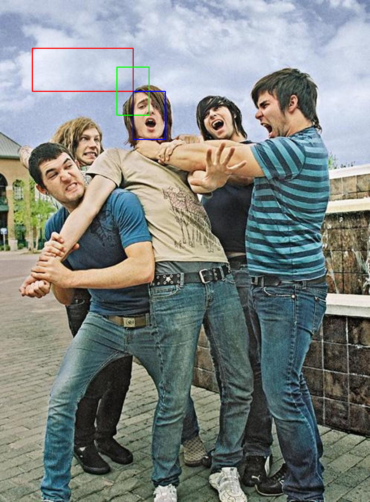

# Yolov5-Face

本文记录了复现[yolov5-face](https://github.com/deepcam-cn/yolov5-face)过程。

## 数据集准备

1. 下载数据集[Widerface images](http://shuoyang1213.me/WIDERFACE/)，[数据集annotations](https://drive.google.com/file/d/1tU_IjyOwGQfGNUvZGwWWM4SwxKp2PUQ8/view?usp=sharing)；

2. 在当前目录新建 original/文件夹，并将下载内容解压到original文件夹中的指定位置,文件夹格式如图所示:

    ```shell
    |---original
    |   |---WIDER_train
    |   |   |---images
    |   |   |   |---0-Parade
    |   |   |   |   |---0_Parade_marchingband_1_5.jpg
    |   |   |   |   |---0_Parade_marchingband_1_6.jpg
    |   |   |   |   |---0_Parade_marchingband_1_6.jpg
    |   |   |   |---1-Handshaking
    |   |   |   |   |---1_Handshaking_Handshaking_1_42.jpg
    |   |   |   |   |---1_Handshaking_Handshaking_1_46.jpg
    |   |   |   |   |---1_Handshaking_Handshaking_1_59.jpg
    |   |   |--- label.txt
    |   |---WIDER_val
    |   |   |---images
    |   |   |   |---0-Parade
    |   |   |   |   |---0_Parade_marchingband_1_20.jpg
    |   |   |   |   |---0_Parade_marchingband_1_74.jpg
    |   |   |   |   |---0_Parade_marchingband_1_78.jpg
    |   |   |   |---1-Handshaking
    |   |   |   |   |---1_Handshaking_Handshaking_1_35.jpg
    |   |   |   |   |---1_Handshaking_Handshaking_1_94.jpg
    |   |   |   |   |---1_Handshaking_Handshaking_1_107.jpg
    |   |   |--- label.txt


    
    ```


    ```bash
    cd YOLOV5-Face
    mkdir original

    cd ~/Downloads
    unzip -d /the/path/of/YOLOV5-Face/original WIDER_train.zip
    unzip -d /the/path/of/YOLOV5-Face/original WIDER_val.zip

    cd ~/Downloads
    unzip -d /the/path/of/YOLOV5-Face/original retinaface_gt_v1.1.zip
    cd /the/path/of/YOLOV5-Face/original
    mv train/label.txt WIDER_train
    mv val/label.txt WIDER_val

    rm -rf train/ val/ test/

    ```


3. 数据集格式转化

* 
    ```bash
    cd data
    python prepare_dataset.py
    ```

* 数据集格式和Darknet Yolo相同，每张图片对应一个.txt标签。标签格式参考Darknet Yolo的数据集标签格式: "category cx, cy, w, h, x1,y1, x2, y2, x3, y3, x4, y4, x5, y5"。其中，category为下标类别（这里设为0）， cx,cy为归一化的标签框中心点坐标， w,h为归一化标签框的宽高， x{1,2,3,4,5}/y{1,2,3,4,5}是指归一化的关键点坐标,.txt标签文件内容示例如下:

    ```shell
    0  0.50146484375 0.2964860907759883 0.0361328125 0.0746705710102489 0.4964423828125 0.2896354319180088 0.51370703125 0.2896354319180088 0.50680078125 0.2981068814055637 0.4986396484375 0.31363689604685213 0.51370703125 0.31269546120058567

    0  0.4150390625 0.3323572474377745 0.037109375 0.07027818448023426 -0.0009765625 -0.0014641288433382138 -0.0009765625 -0.0014641288433382138 -0.0009765625 -0.0014641288433382138 -0.0009765625 -0.0014641288433382138 -0.0009765625 -0.0014641288433382138

    ```


* 图片与其对应的标签文件同名，存放在同一个目录下。数据文件结构如下：

    ```bash
    |---train
    |    |---0_Parade_marchingband_1_5.jpg
    |    |---0_Parade_marchingband_1_5.txt
    |    |---0_Parade_marchingband_1_6.jpg
    |    |---0_Parade_marchingband_1_6.txt
    |    |---0_Parade_marchingband_1_8.jpg
    |    |---0_Parade_marchingband_1_8.txt
    |---val
    |   |---0_Parade_marchingband_1_20.jpg
    |   |---0_Parade_marchingband_1_20.txt
    |   |---0_Parade_marchingband_1_74.jpg
    |   |---0_Parade_marchingband_1_74.txt

    ```

* 注意下载的原始数据集格式是: "x1, y1, w, h"。其中， x1,y1是标签框左上角坐标， w,h是标签框的宽高，可通过代码验证:

    ```bash
    cd data
    python val_label_format.py
    ```

    * 红色框：假设标签格式：x1 y1 x2  y2   
    * 绿色框：假设标签格式：center_x center_y w h
    * 蓝色框：假设标签格式：x1, y1, w,h(原始数据集格式) 


    


